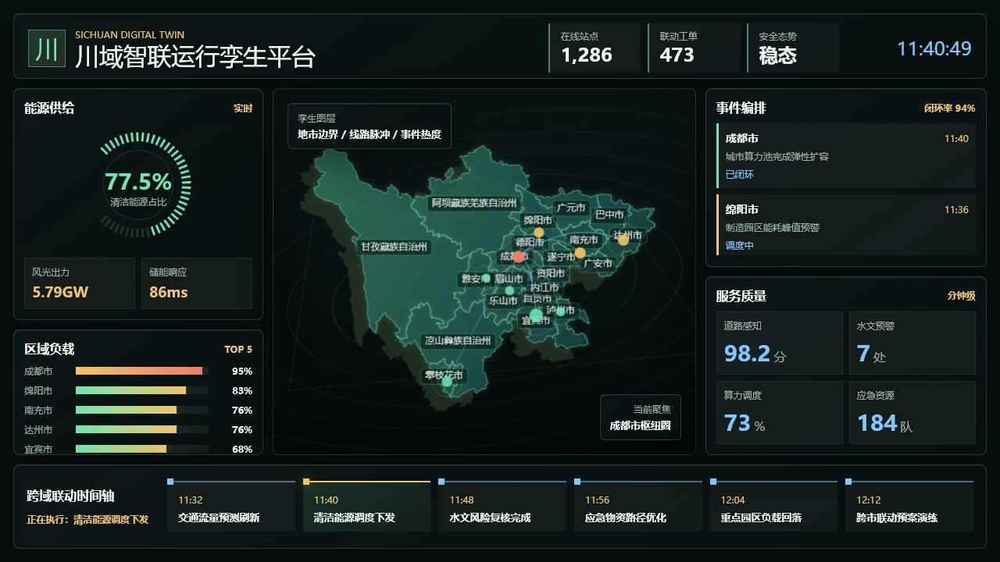

# Sichuan Digital Twin Dashboard

> A lightweight, zero-runtime-dependency digital twin dashboard template for Sichuan province, designed for smart city operations, energy dispatching, traffic monitoring, hydrology alerts and emergency command scenarios.

[中文文档](./README.md) · [Contributing](./CONTRIBUTING.md) · [Security](./SECURITY.md)

## Overview

Sichuan Digital Twin Dashboard is a browser-native data visualization project built with HTML, CSS and JavaScript. It renders prefecture-level Sichuan GeoJSON on Canvas and provides animated map layers, full city labels, route pulses, event orchestration, energy metrics, regional load ranking and a rolling coordination timeline.

The project does not depend on React, Vue, ECharts or Three.js at runtime. It is suitable as a clean starter template for:

- Smart city command centers
- Provincial energy operation dashboards
- Traffic and emergency response screens
- Hydrology, meteorology, industrial park or tourism monitoring demos
- Academic projects, visualization competitions and open-source showcases

## Live Demo

After GitHub Pages is enabled, the dashboard is deployed to:

```text
https://davidsun1234.github.io/sichuan-digital-twin-dashboard/
```

Run locally:

```bash
npm install
npm run dev
```

Open:

```text
http://127.0.0.1:4173/
```

The repository also works with any static file server.

## Preview



## Features

- **Prefecture-level Sichuan map rendering**  
  Draws 21 prefecture-level administrative regions from `assets/sichuan.geojson`, including full labels, hover highlighting and tooltips.

- **High-DPI friendly Canvas hit testing**  
  Uses cached hit paths and unscaled Canvas coordinates to avoid pointer offset issues caused by device pixel ratio, browser zoom or CSS scaling.

- **Animated energy module**  
  Clean energy ratio, wind/solar output and storage response time update continuously.

- **Dynamic regional load ranking**  
  TOP 5 city loads update and reorder over time, with visual states for normal, warning and high-load conditions.

- **Event orchestration feed**  
  Rotating event cards include city name, event description, processing status and closure rate.

- **Rolling coordination timeline**  
  Timeline items advance automatically and highlight the active task.

- **Zero runtime dependency**  
  The dashboard runs with browser-native APIs only. It can be deployed to GitHub Pages, object storage, Nginx or any internal static server.

- **Open-source ready repository structure**  
  Includes bilingual documentation, MIT license, contributing guide, code of conduct, issue templates, pull request template, security policy and GitHub Pages workflow.

## Tech Stack

| Area | Choice |
| --- | --- |
| Markup | HTML5 |
| Styling | CSS3, responsive Grid, Canvas overlays |
| Map rendering | Canvas 2D + GeoJSON |
| Dynamic data | Native JavaScript timers |
| Deployment | GitHub Pages / any static server |
| Runtime dependencies | None |

## Project Structure

```text
.
├── .github/
│   ├── ISSUE_TEMPLATE/
│   │   ├── bug_report.md
│   │   └── feature_request.md
│   ├── workflows/
│   │   └── pages.yml
│   └── PULL_REQUEST_TEMPLATE.md
├── assets/
│   └── sichuan.geojson
├── docs/
│   └── preview.png
├── scripts/
│   └── check-project.mjs
├── app.js
├── index.html
├── styles.css
├── package.json
├── README.md
├── README.en.md
├── CONTRIBUTING.md
├── CODE_OF_CONDUCT.md
├── SECURITY.md
└── LICENSE
```

## Quick Start

### 1. Clone

```bash
git clone https://github.com/davidsun1234/sichuan-digital-twin-dashboard.git
cd sichuan-digital-twin-dashboard
```

### 2. Install development dependency

```bash
npm install
```

### 3. Run locally

```bash
npm run dev
```

### 4. Validate project

```bash
npm run check
```

The check verifies required files, GeoJSON parseability, HTML references and obvious legacy markers.

## Data Model

The current project uses simulated operational data:

- `cities`: highlighted city points, base load and dynamic state.
- `eventPool`: event orchestration records with city, description, level and status.
- `timelinePool`: coordination timeline tasks.
- `assets/sichuan.geojson`: Sichuan prefecture-level administrative boundaries.

To connect real data, replace these functions:

- `updateLoadData()` for regional load.
- `updateEventList()` for event orchestration.
- `updateTimeline()` for coordination timeline.
- `updateEnergyData()` for energy metrics.

Possible data sources:

- REST API
- WebSocket
- Server-Sent Events
- Local JSON files
- Edge gateway telemetry

## Map Interaction Design

The map is rendered in four conceptual layers:

1. Radar rings and background grid.
2. Prefecture-level administrative polygons.
3. Full prefecture/city labels.
4. Route pulses, key points and event heat indicators.

On hover, the dashboard updates:

- Region highlight.
- Tooltip.
- Current focus area.

## Deployment

### GitHub Pages

The repository includes `.github/workflows/pages.yml`.

1. Open repository `Settings`.
2. Go to `Pages`.
3. Set source to `GitHub Actions`.
4. Push to `main`.
5. GitHub Actions will deploy the static dashboard.

### Nginx

```nginx
server {
  listen 80;
  server_name dashboard.example.com;
  root /var/www/sichuan-digital-twin-dashboard;
  index index.html;
}
```

### Object Storage / CDN

Upload the static files in the repository root. Ensure:

- `index.html` is at the site root.
- `assets/sichuan.geojson` is accessible.
- No third-party font is bundled. The dashboard uses a system font stack by default.

## Browser Support

- Chrome 100+
- Edge 100+
- Firefox 100+
- Safari 15+

The dashboard relies on Canvas 2D, CSS Grid, Fetch API and modern JavaScript.

## License

Released under the [MIT License](./LICENSE).

Note: map data and third-party assets may have their own licenses. This project no longer bundles fonts with unclear redistribution terms and uses a system font stack by default. Before publishing publicly, verify that the GeoJSON data source is allowed to be redistributed in an open-source repository.
